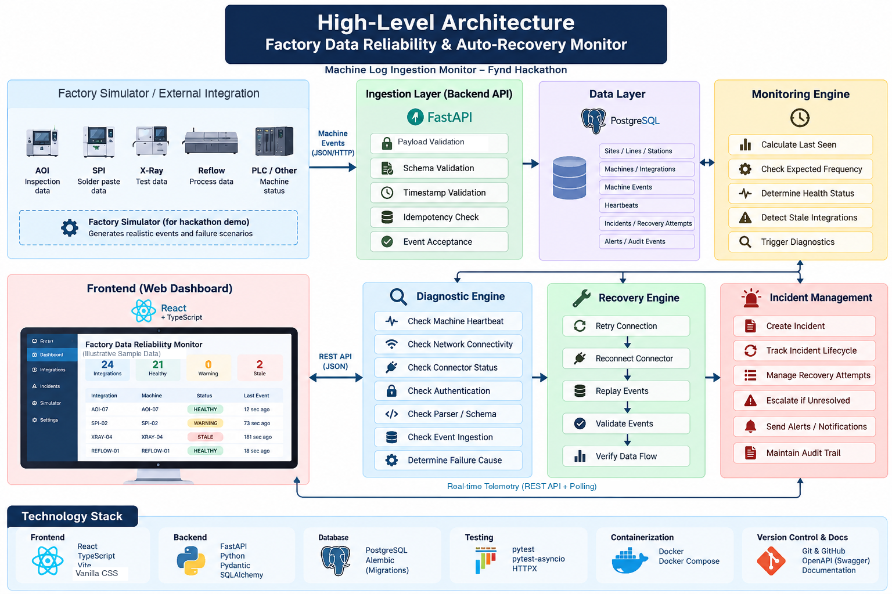
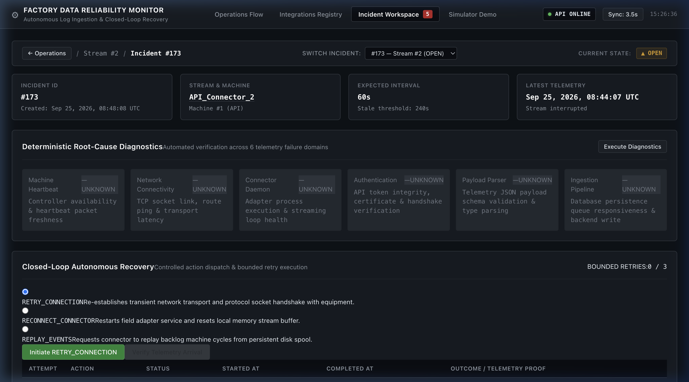
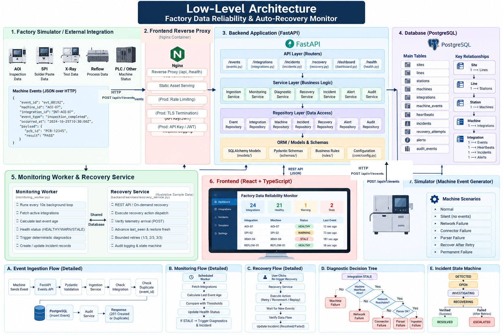

# Factory Data Reliability & Auto-Recovery Monitor

> **Autonomous machine telemetry health monitoring, deterministic root-cause diagnosis, and closed-loop auto-recovery with database-verified telemetry proof for manufacturing lines.**

[](tests/)
[](backend/)
[](backend/main.py)
[](docker-compose.yml)
[](frontend/)
[](docker-compose.yml)

---

## High-Level Architecture

The system is designed as a **modular monolith** for the hackathon MVP, establishing clean architectural boundaries between ingestion, monitoring, deterministic diagnosis, controlled recovery, relational persistence, and operator consoles.


*(Note: Diagram shows system architectural domains. The dashboard metrics shown in the mockup [24 Integrations, 21 Healthy, 0 Warning, 2 Stale] are Illustrative UI values; runtime metrics are dynamically monitored from PostgreSQL.)*

```
Factory Equipment / Simulator
             │
             ▼  (HTTP POST /api/v1/events)
   [ Event Ingestion API ] ──► [ PostgreSQL 15 ]
             │                          │
             ▼                          ▼
 [ Background Monitor Worker ] ◄────────┘ (Freshness Evaluation)
             │
             ▼
   DETECT (HEALTHY → WARNING → STALE)
             │
             ▼
   DIAGNOSE (Deterministic 6-Vector Probe)
             │
             ▼
   RECOVER (Bounded Action: RETRY, RECONNECT, REPLAY)
             │
             ▼
   WAIT FOR NEW TELEMETRY (External stream resumes)
             │
             ▼
   VERIFY (received_at > recovery_started_at AND last_seen_at advanced)
        ┌────┴────┐
        ▼         ▼
     VERIFIED   TIMEOUT / NO EVENT
        │         │
        ▼         ▼
     RESOLVED   FAILED (Bounded Retries: Max 3 Attempts)
                  │
                  ▼
                ESCALATED
```

### Component Responsibility Matrix

| Component | Responsibility | Technical Boundary |
|---|---|---|
| **Factory / Simulator** | Simulates machine lines and emits cycle events or failure modes | External HTTP client (`POST /api/v1/events`); zero database access |
| **Ingestion API** | Validates payloads, handles timestamps, enforces idempotency, updates `last_seen_at` | FastAPI router + Pydantic v2 schemas + SQL transactions |
| **PostgreSQL 15** | ACID store for factory hierarchy, machine events, incidents, and audit trails | Relational models with foreign keys, indexes, and Alembic migrations |
| **Monitoring Worker** | Evaluates stream freshness against line thresholds (`expected`, `warning`, `stale`) | Background worker loop evaluating timestamp deltas (`now - last_seen_at`) |
| **Diagnostic Service** | Deterministically pinpoints probable root cause across 6 failure domains | Domain logic evaluating machine heartbeat, network, connector, auth, parser, and ingestion |
| **Recovery Service** | Orchestrates bounded non-destructive recovery actions | Controlled state machine (`OPEN` → `RECOVERING` → `VERIFIED`/`FAILED`) |
| **Verification Guard** | Enforces telemetry proof invariant before declaring resolution | Requires genuine new machine event persisted after recovery start; duplicate events rejected |
| **Incident Management** | Tracks incident lifecycle, bounded retries (1/3, 2/3, 3/3), and auto-escalation | State machine: `OPEN` → `RECOVERING` → `RESOLVED` or `ESCALATED` |
| **Frontend Reverse Proxy** | Serves compiled React assets and reverse-proxies `/api/` and `/health` requests | Nginx container routing browser calls to `http://backend:8000` |
| **Industrial Dashboard** | Control room operator console for flow visualization, incident triage, and demo testing | React 19 + TypeScript + Vite + Vanilla CSS design system |

---

## 1. Problem Statement & Why It Matters

### The Operational Problem
In modern high-speed surface-mount technology (SMT) and discrete manufacturing lines (AOI, SPI, X-Ray, Reflow), equipment generates telemetry at intervals between 1 to 30 seconds. When an integration **silently stops transmitting data**—due to an unhandled connector crash, network socket timeout, expired API token, or parser schema mismatch—production physically continues running.

### Why It Matters
* **Silent Defect Spikes:** Inspection stations (AOI/SPI) fail to log board defect patterns. Thousands of defective PCBs can be processed before discovery.
* **Delayed MTTD (Mean Time to Detect):** Manual discovery typically takes hours, usually when a downstream line lead notices a gap in ERP/MES records.
* **False Recovery Risks:** Conventional field support dashboards often allow operators to click "Retry" or "Reset" and immediately mark the issue "Resolved", creating a false sense of security while data remains uncollected.

---

## 2. What We Built

We built an **industrial data reliability and auto-recovery system** that treats machine telemetry as a closed loop. The platform:
1. **Detects** stream silence before it disrupts operations.
2. **Diagnoses** the probable cause across 6 industrial failure vectors deterministically.
3. **Dispatches** bounded recovery actions (`RETRY_CONNECTION`, `RECONNECT_CONNECTOR`, `REPLAY_EVENTS`).
4. **Verifies** recovery strictly against **actual new, persisted telemetry in the database** before transitioning to `RESOLVED`.
5. **Escalates** automatically when 3 bounded retries are exhausted to prevent infinite loops.

---

## 3. Core Closed-Loop Workflow

```
DETECT ──► DIAGNOSE ──► RECOVER ──► VERIFY ──► RESOLVE / ESCALATE
```

### 1. DETECT
The monitoring worker evaluates equipment freshness:
$$\Delta t = \text{now}() - \text{Integration.last\_seen\_at}$$
* $\Delta t \le \text{expected\_interval}$: **HEALTHY**
* $\text{expected\_interval} < \Delta t \le \text{warning\_threshold}$: **WARNING**
* $\Delta t > \text{stale\_threshold}$: **STALE** → A single active **Incident** is opened in state `OPEN`. Duplicate active incidents are rejected by database-level active state checks.

### 2. DIAGNOSE
The diagnostic engine evaluates 6 failure domains and assigns deterministic statuses (`PASS`, `FAIL`, `UNKNOWN`):
* `machine_heartbeat`: Is the physical machine heartbeat alive and responsive?
* `network`: Is the integration endpoint reachable over the plant network?
* `connector`: Is the connector adapter process active and responsive?
* `authentication`: Are API credentials, mutual TLS, or access tokens valid?
* `parser`: Can the payload parser successfully parse sample machine data without schema faults?
* `ingestion`: Is the internal event ingestion pipeline operational?

The engine evaluates precedence to pinpoint the **Probable Cause** (`MACHINE_OFFLINE`, `NETWORK_UNREACHABLE`, `CONNECTOR_CRASHED`, `AUTH_EXPIRED`, `PARSER_FAULT`, `INGESTION_ERROR`, or `UNKNOWN`).

### 3. RECOVER
An operator or automated policy triggers a non-destructive recovery action:
* `RETRY_CONNECTION`: Soft reconnect / socket reset.
* `RECONNECT_CONNECTOR`: Hard adapter restart.
* `REPLAY_EVENTS`: Buffer replay from edge storage.

The incident moves from `OPEN`/`FAILED` to `RECOVERING`. Database concurrency locks prevent multiple simultaneous recovery operations for the same stream.

### 4. VERIFY
The system enters verification. **Crucial Rule:** Recovery is **never** declared successful merely because the recovery action endpoint executed.

To verify:
1. The database checks for a machine event where:
   $$\text{received\_at} > \text{RecoveryAttempt.attempted\_at}$$
2. The database confirms that `Integration.last_seen_at` has **strictly advanced** beyond the recovery start time.
3. If new telemetry is confirmed: State moves `RECOVERING` → `VERIFIED` → `RESOLVED`, and the Integration health returns to `HEALTHY`.
4. If no telemetry is detected or the timeout expires: The attempt is recorded as `FAILED`, and the incident returns to `FAILED` awaiting operator retry or automatic escalation.

### 5. ESCALATE
Retries are strictly bounded:
* Attempt 1 / 3 → FAILED
* Attempt 2 / 3 → FAILED
* Attempt 3 / 3 → FAILED → **ATTEMPTS EXHAUSTED**
* Incident transitions to `ESCALATED` and Integration is marked `FAILED`. A 4th retry is rejected with HTTP `400 Bad Request`.

---

## 4. Recovery Verification Proof

The most critical architectural guarantee of this platform is **zero false-positive resolution**. 


*(Incident Workspace: Deterministic Diagnosis, Bounded Retries Meter, and Verification Proof)*

When recovery succeeds, the platform displays an explicit 4-point verification audit:
1. **New Event Received:** Confirms a new telemetry event arrived at the API after the recovery start timestamp.
2. **Event Persisted in DB:** Confirms the event passed idempotency and schema validation and was committed to `machine_events`.
3. **last_seen_at Advanced:** Confirms the integration timestamp moved forward, proving telemetry freshness.
4. **Health Restored:** Confirms the integration state transitioned back to `HEALTHY`.

> [!IMPORTANT]
> **Recovery command success != verified recovery.**
> 
> Verification requires:
> - new machine telemetry
> - event persisted
> - last_seen_at advanced
> - freshness restored

---

## 5. Bounded Recovery & Safety Guarantees

```
Attempt 1 / 3 ──► FAILED
       │
Attempt 2 / 3 ──► FAILED
       │
Attempt 3 / 3 ──► FAILED ──► ESCALATED (Integration: FAILED)
       │
Attempt 4 ──────► REJECTED (HTTP 400 Bad Request)
```

1. **Max 3 Bounded Retries:** Prevents infinite retry loops against dead hardware.
2. **Concurrency State Guard:** Active recovery operations lock the integration record; concurrent recovery calls for the same incident return HTTP `409 Conflict`.
3. **Idempotency Invariant:** Ingesting duplicate `event_id` payloads returns existing data (HTTP 200/201) but **never advances** `last_seen_at`, preventing replay attacks from falsely verifying recovery.
4. **False-Verification Protection:** Calling `/verify` without genuine new telemetry always returns `verified: false`.

---

## 6. Low-Level Architecture & Codebase Design

The backend is built as a clean multi-layer application conforming to enterprise Python standards.



### Backend Layer Structure
```
backend/
├── api/                     # API Layer: HTTP request routing & error unwrapping
│   ├── events.py            # Event ingestion endpoints (POST /api/v1/events)
│   ├── integrations.py      # Integration registry (GET /api/v1/integrations)
│   └── incidents.py         # Incident triage, diagnose, recover, and verify
├── services/                # Service Layer: Business rules & state machines
│   ├── event_service.py     # Ingestion validation & idempotency checks
│   ├── monitoring_service.py# Freshness calculations & stale transitions
│   ├── diagnostic_service.py# Deterministic 6-vector diagnosis engine
│   └── recovery_service.py  # Bounded recovery execution & telemetry verification
├── repositories/            # Repository Layer: Pure database access & queries
│   ├── event_repository.py
│   ├── monitoring_repository.py
│   └── recovery_repository.py
├── models.py                # Database Layer: SQLAlchemy ORM domain entities
├── schemas/                 # Contract Layer: Pydantic v2 request/response schemas
├── database.py              # Engine configuration, sessionmaker, & pool pre-ping
├── seed.py                  # Initial factory site, line, and machine seeding
├── workers/                 # Background execution: Asynchronous monitoring loop
└── alembic/                 # Schema version control & repeatable migrations
```

---

## 7. Architecture Decisions & MVP Boundaries

| Design Decision | Chosen Approach | Rationale for MVP | Production Evolution |
|---|---|---|---|
| **Architecture Pattern** | Modular Monolith | Single cohesive repository, clean layer boundaries, zero network latency between services, predictable Docker Compose orchestration. | Can split Ingestion into a dedicated microservice when traffic exceeds 50,000 events/sec. |
| **Backend Framework** | FastAPI + Pydantic v2 | Strict request validation, auto-generated OpenAPI docs, native async support, and high throughput. | Add gRPC endpoints for binary PLC protocols. |
| **Database** | PostgreSQL 15 | Relational integrity for factory equipment hierarchy, transactional safety for incident states, and B-tree indexes on `(integration_id, received_at)`. | Read replicas, high-availability Patroni cluster, TimescaleDB hypertable for telemetry events. |
| **Diagnostics** | Deterministic Decision Tree | Explainable, reproducible, verifiable, zero latency, and safe for factory automation without hallucination risk. | Incorporate ML anomaly detection models on multi-sensor cycle drift. |
| **UI Updates** | REST API + 3.5s Polling | Simple operational model, clean interval teardown, concurrency guard lock, zero persistent socket connection overhead. | WebSockets / Server-Sent Events (SSE) for 10,000+ concurrent operators. |
| **Frontend Reverse Proxy** | Nginx Alpine Container | Serves production React bundle and reverse-proxies `/api/` and `/health` to eliminate CORS and hardcoded ports. | Production TLS termination, rate limiting, and Kubernetes Ingress Controller. |

### Explicit Scope Clarifications (MVP vs. Production)
* **Frontend Reverse Proxy:** Nginx in this repository serves static assets and reverse-proxies API calls. It is **not** configured as a multi-node load balancer or SSL termination gateway.
* **Authentication & RBAC:** The hackathon MVP does not implement user authentication (JWT/API Keys). In production, this would sit at the API Gateway layer.
* **Diagnostic Probes:** Diagnostic domains evaluate deterministic conditions and probe overrides; the MVP does not actively probe physical high-voltage factory PLC hardware.
* **Recovery Worker:** Recovery execution is handled synchronously by the `RecoveryService` state machine; it is not yet dispatched to a distributed Celery or Temporal queue.

---

## 8. Hackathon Simulator (Transparency Notice)

> **TRANSPARENCY NOTICE:**  
> There is no physical factory equipment connected to this evaluation environment. The repository includes an external **Factory Event Simulator** that behaves like a physical machine integration and transmits events strictly through the public HTTP ingestion API (`POST /api/v1/events`).

* **External HTTP Ingestion Only:** The simulator sends machine events through the same HTTP ingestion API and does not access PostgreSQL directly.
* **Zero Direct DB Access:** The simulator contains **no database credentials, models, or drivers**.
* **Simulated Equipment Scenarios:**
  1. `NORMAL`: Emits valid cycle telemetry at expected intervals to maintain `HEALTHY` state.
  2. `SILENT`: Emits initial bursts then abruptly halts transmission to test stale detection.
  3. `RECOVER_AFTER_RETRY`: Pauses transmission, waits until recovery is dispatched (`RECOVERING`), then automatically resumes valid telemetry to trigger verification success.
  4. `PERMANENT_FAILURE`: Hardware is simulated dead; remains completely silent across all 3 recovery attempts to trigger automatic escalation.

---

## 9. Quick Start & Execution

### Option A: Complete Docker Compose (Recommended)

Start the entire stack (PostgreSQL, Backend API, and Frontend) with a single command:
```bash
docker compose up --build
```

**Verified Endpoints:**
* **Frontend Dashboard:** `http://localhost:5173`
* **Backend API & Swagger Docs:** `http://localhost:8000/docs`
* **Health Check Probe:** `http://localhost:8000/health`

### Option B: Local Python & Node Development

1. **Start PostgreSQL:**
   ```bash
   docker compose up -d db
   ```
2. **Setup Python Virtual Environment & Install Dependencies:**
   ```bash
   python3 -m venv venv
   source venv/bin/activate
   pip install -r backend/requirements.txt
   ```
3. **Execute Migrations & Seed Equipment Hierarchy:**
   ```bash
   alembic -c backend/alembic.ini upgrade head
   python -m backend.seed
   ```
4. **Launch Backend Server:**
   ```bash
   uvicorn backend.main:app --host 0.0.0.0 --port 8000 --reload
   ```
5. **Launch Frontend Development Server:**
   ```bash
   cd frontend
   npm install
   npm run dev
   ```
   Open `http://localhost:5173` in your browser.

---

## 10. Demo Scenarios & Walkthrough

Follow these steps for a complete 3-minute live evaluation:

### Scenario 1 — Normal Stream Operation
1. Navigate to **Operations Flow** (`http://localhost:5173`).
2. Run the simulator in `NORMAL` mode:
   ```bash
   python -m simulator.machine_simulator --scenario NORMAL --interval 1.0 --integration-id 1
   ```
3. Observe the green operational banner: Stream stays `HEALTHY`, and freshness updates in real time.

### Scenario 2 — Silent Failure & Stale Detection
1. Run the simulator in `SILENT` mode (emits 3 events then halts):
   ```bash
   python -m simulator.machine_simulator --scenario SILENT --initial-events 3 --integration-id 1
   ```
2. As time exceeds the stale threshold, the stream transitions: `HEALTHY` → `WARNING` → `STALE`.
3. An `ATTENTION REQUIRED` banner appears, and an active Incident is created.

### Scenario 3 — Triage, Auto-Recovery, and Verification (Scenario A)
1. Run the auto-recovery simulator:
   ```bash
   python -m simulator.machine_simulator --scenario RECOVER_AFTER_RETRY --integration-id 1
   ```
2. Click **Incident Workspace** in the top navigation.
3. Click **Run Diagnostics** → Observe the 6-vector check matrix evaluate and pinpoint the probable cause.
4. Click **Initiate Recovery** (`RETRY_CONNECTION`) → State changes to `RECOVERING`.
5. The simulator detects the recovery state and resumes emitting telemetry.
6. Click **Verify Telemetry** → Recovery verifies against the new persisted telemetry: State transitions `VERIFIED` → `RESOLVED`, and stream health returns to `HEALTHY`.

### Scenario 4 — Permanent Failure & Escalation (Scenario B)
1. Run the permanent failure simulator:
   ```bash
   python -m simulator.machine_simulator --scenario PERMANENT_FAILURE --integration-id 1
   ```
2. In the Incident Workspace, click **Initiate Recovery** → Click **Verify Telemetry** (Attempt 1 / 3 Fails).
3. Repeat recovery (Attempt 2 / 3 Fails).
4. Repeat recovery (Attempt 3 / 3 Fails).
5. Attempts are exhausted: Incident moves to `ESCALATED`, Integration moves to `FAILED`, and subsequent retry attempts are rejected.

---

## 11. Testing & Validation

The codebase includes an automated test suite covering all critical product invariants:

```bash
pytest -v
```

### Verified Test Suite Results (58 Tests Passed)
* **Machine Event Ingestion (13 tests):** Valid ingestion, missing fields, schema validation, timestamp handling, duplicate rejection, rollback safety.
* **Monitoring & Stale Detection (10 tests):** Freshness calculation, warning thresholds, stale boundary determinism, non-duplicate active incidents.
* **Deterministic Diagnostics (12 tests):** 6-vector domain probes, precedence ordering, diagnostic persistence, error handling.
* **Controlled Recovery & Telemetry Verification (16 tests):** Bounded attempts, state transitions, last_seen advancement, duplicate replay rejection, concurrent recovery lock.
* **Factory Simulator (7 tests):** Payload generation, unique UUIDs, HTTP client error resilience, scenario execution.

### Frontend Production Build
```bash
cd frontend && npm run build
```
* **TypeScript Errors:** `0`
* **Vite Production Bundle:** Built in `~100ms` with zero external UI framework dependencies.

---

## 12. Tech Stack

| Category | Technology | Purpose |
|---|---|---|
| **Frontend** | React 19, TypeScript, Vite | Industrial Control Room Single Page Application |
| **Styling** | Vanilla CSS Design Tokens | Dark neutral industrial theme (`#0d1117`), high contrast, accessible |
| **Backend** | Python 3.11+, FastAPI, Pydantic v2 | High-throughput REST API, schema validation, domain services |
| **Database** | PostgreSQL 15, SQLAlchemy 2.0 | ACID persistence, relational hierarchy, B-tree indexes |
| **Migrations** | Alembic | Repeatable schema versioning and database migrations |
| **Simulator** | Python 3, `httpx` | External equipment simulation communicating strictly over HTTP |
| **Testing** | Pytest, Pytest-Asyncio, HTTPX | Comprehensive 58-test unit and end-to-end integration suite |
| **Containerization** | Docker, Docker Compose, Nginx | Multi-container zero-setup local deployment |

---

## 13. Hackathon Evaluation Alignment

| Evaluation Criteria | Implementation Evidence |
|---|---|
| **Functional Correctness** | Closed-loop workflow works end-to-end: Detect → Diagnose → Recover → Verify → Resolve / Escalate. 58/58 backend tests passing. |
| **Problem Solving** | Eliminates false-positive recovery by requiring genuine new telemetry persisted after recovery start before marking incidents resolved. |
| **Engineering Quality** | Strict layer separation (Routers → Services → Repositories → Models). Type-safe TypeScript frontend. Bounded retries and database concurrency locks. |
| **Security & Safety** | Clean repository audit: zero secrets committed, zero `.env` files tracked, input validation via Pydantic schemas. |
| **Documentation & Demo** | High-level and low-level architecture diagrams, complete walkthrough scenarios, and automated Docker Compose setup. |
| **Operational Usability** | Custom industrial control room interface designed for factory floor monitoring, avoiding generic dashboard templates. |

---

## 14. AI Tool Usage Declaration

In accordance with hackathon evaluation guidelines, we declare that an agentic AI coding assistant (**Antigravity by Google DeepMind**) was utilized during development for rapid prototyping, architectural drafting, test scaffolding, and frontend refactoring. 

All database schemas, API boundaries, state machines, deterministic diagnostic trees, recovery verification algorithms, and tests were verified, tested, executed, and validated by the developer.

---

## License
MIT License. Developed for technical evaluation at the Fynd Hackathon.
